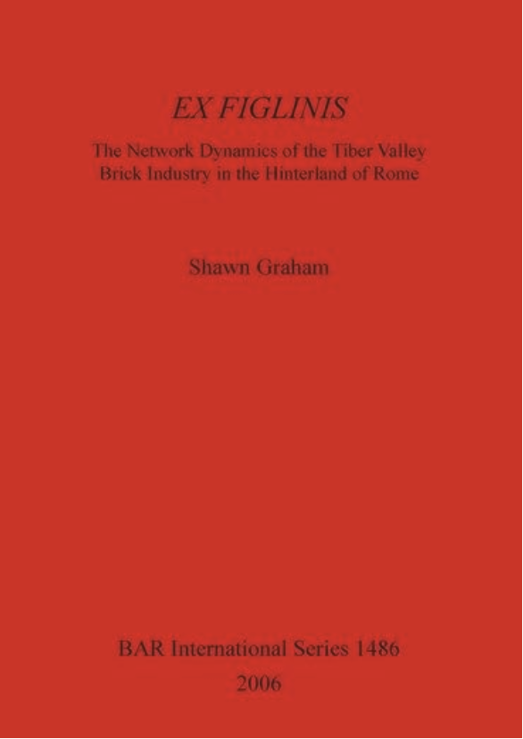
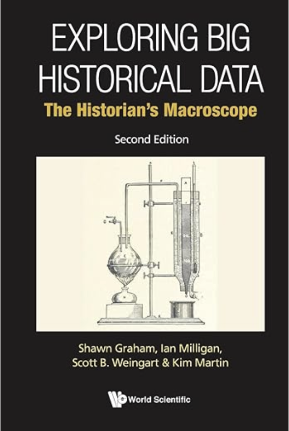
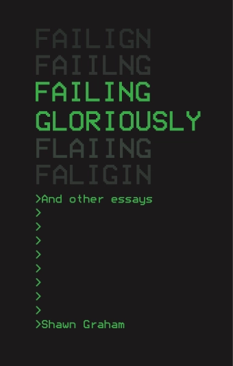
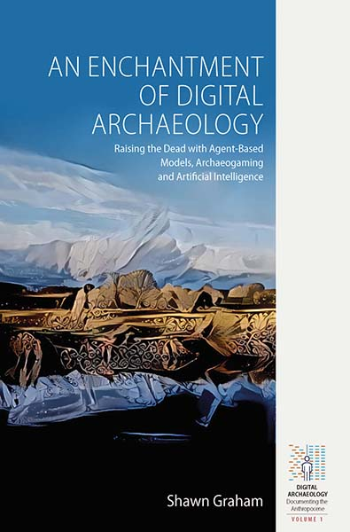
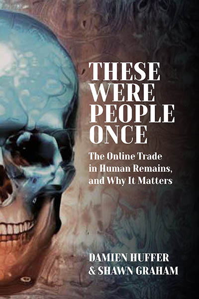
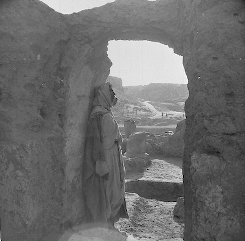

# Shawn M. Graham, PhD

Dr. Shawn Graham is a digital archaeologist and Full Professor in the [Department of History at Carleton University in Ottawa, Canada](https://carleton.ca/history). He is also the [Programme Coordinator for the MA specialization in Digital Humanities](https://carleton.ca/dighum). He founded and edits the open access journal [Epoiesen: A Journal for Creative Engagement in History and Archaeology](https://epoiesen.carleton.ca/).

[Carleton U](https://carleton.ca/history/people/shawn-graham/) | [Scholar.Social](https://scholar.social/@electricarchaeo) | [Github](https://github.com/shawngraham) | [Research Blog](https://electricarchaeology.ca)

Scroll along to find more about his:  
[research](#research), [publications](#books), [courses](#courses) & [how this site was made](#colophon).  

---

## Research 

His current major research project, together with his collaborator Damien Huffer, uses neural networks and computer vision to explore the online trade in human remains (The Bone Trade Project). As part of the Computational Research in the Ancient Near East (CRANE) Project from the University of Toronto, he is exploring generative adversarial networks and archaeological photography. With Dr. Donna Yates of the University of Maastricht, he is exploring knowledge graph embedding models of the antiquities trade (The New Organigram Project). For more on his research, see his [books](#books) and selected [articles](#articles).

His work has been featured in [WIRED Magazine](https://www.wired.co.uk/article/instagram-skull-trade), [The Washington Post](https://www.washingtonpost.com/science/2021/10/09/tiktok-jonsbones-human-remains-wall-spines/), [The New York Times](https://www.nytimes.com/2020/11/24/science/artificial-intelligence-archaeology-cnn.html#click=https://t.co/sxyEN0tJtu), and the [Ottawa Citizen](https://ottawacitizen.com/news/local-news/carleton-prof-harnesses-machine-learning-to-explore-the-bone-trade-netherworld/). He has frequently been interviewed concerning the human remains trade as [new criminal cases come to light](https://www.nbcboston.com/investigations/harvards-morgue-scandal-is-part-of-a-much-larger-story-in-trading-human-remains/3136374/).

In 2019, he won the [Archaeological Institute of America’s Award for Outstanding Work in Digital Archaeology](https://www.archaeological.org/grant/digital-archaeology-award/) for leading the creation of the ‘Open Digital Archaeology Textbook Environment’, [O-DATE](https://o-date.github.io/).

### The X-Lab

[The XLab – The Cultural Heritage Informatics Collaboratory –](https://carleton.ca/xlab) represents both a space and a series of relationships within and without the University. It is a kind of transdisciplinary ‘skunkworks’ for fostering encounters with and between cultural heritage and digital media and computation. As a skunkworks, or a space for trying non-traditional or imaginative new solutions, it aims to bring together tenacious tinkerers, who are willing to experiment, to wonder, to try, and to iterate – to try, try again. The XLab is led by Graham and [Laura Banducci](https://carleton.ca/grs/people/laura-banducci/).

The XLab is always interested in collaborators.

---

## Books

Graham has published several works that range from archaeological investigations to more philosophical ruminations on what it means to 'fail gloriously' in the digital humanities 

### Ex Figlinis

The growth of the city of Rome was dependent on its ability to exploit successfully the human and natural resources of its hinterland. Although this eventually expanded to incorporate the entire Mediterranean seaboard, the resources of the Tiber Valley originally nourished the city and continued to do so despite the growth in imports from elswhere in the Roman world. This study examines the way the Tiber Valley functioned in terms of its economic and social geography, as evidenced by the organisation and dynamics of the brick industry. [Available via Humanities Commons](https://hcommons.org/deposits/item/hc:18909/).

### Exploring Big Historical Data

Written with Ian Milligan and Scott Weingart (1st edition) and Kim Martin (2nd edition)

The Digital Humanities have arrived at a moment when digital Big Data is becoming more readily available, opening exciting new avenues of inquiry but also new challenges. This pioneering book describes and demonstrates the ways these data can be explored to construct cultural heritage knowledge, for research and in teaching and learning. It helps humanities scholars to grasp Big Data in order to do their work, whether that means understanding the underlying algorithms at work in search engines, or designing and using their own tools to process large amounts of information.Demonstrating what digital tools have to offer and also what 'digital' does to how we understand the past, the authors introduce the many different tools and developing approaches in Big Data for historical and humanistic scholarship, show how to use them, what to be wary of, and discuss the kinds of questions and new perspectives this new macroscopic perspective opens up. [Find your closest copy via WorldCat](https://search.worldcat.org/title/898158974)

### Failing Gloriously

**Please, you gotta help me. I’ve nuked the university.**

Failing Gloriously and Other Essays documents Shawn Graham’s odyssey through the digital humanities and digital archaeology against the backdrop of the 21st-century university. At turns hilarious, depressing, and inspiring, Graham’s book presents a contemporary take on the academic memoir, but rather than celebrating the victories, he reflects on the failures and considers their impact on his intellectual and professional development. These aren’t heroic tales of overcoming odds or paeans to failure as evidence for a macho willingness to take risks. They’re honest lessons laced with a genuine humility that encourages us to think about making it safer for ourselves and others to fail.

A foreword from Eric Kansa and an afterword by Neha Gupta engage the lessons of Failing Gloriously and consider the role of failure in digital archaeology, the humanities, and social sciences. [Full text Open Access download here](https://digitalpressatund.files.wordpress.com/2019/12/failing_gloriously_final.pdf)

### An Enchantment of Digital Archaeology

The use of computation in archaeology is a kind of magic, a way of heightening the archaeological imagination. Agent-based modelling allows archaeologists to test the ‘just-so’ stories they tell about the past. It requires a formalization of the story so that it can be represented as a simulation; researchers are then able to explore the unintended consequences or emergent outcomes of stories about the past. Agent-based models are one end of a spectrum that, at the opposite side, ends with video games. This volume explores this spectrum in the context of Roman archaeology, addressing the strengths, weaknesses, and opportunities of a formalized approach to computation and archaeogaming. [Find your closest copy via WorldCat](https://search.worldcat.org/title/1160958438).

### These Were People Once

Written with Damien Huffer

People buy and sell human remains online. Most of this trade these days is over social media. In a study of this ‘bone trade’, how it works, and why it matters, the authors review and use a variety of methods drawn from the digital humanities to analyze the sheer volume of social media posts in search of answers to questions regarding this online bone trade. The answers speak to how the 21st century understands and constructs ‘heritage’ more generally: each person their own expert, yet seeking community and validation, and like the major encyclopedic museums, built on a kind of digital neocolonialist othering of the dead. [Find your closest copy via WorldCat](https://search.worldcat.org/title/1394119169).

---

## Articles

Here are a few of his favourite articles; for more see his [Google Scholar profile](https://scholar.google.com/citations?user=IU6usq8AAAAJ&hl=en&authuser=1).

### From the Organigram Project

Donna Yates and Shawn Graham (2024) "Reputation laundering and museum
collections: patterns, priorities, provenance, and hidden crime", _International Journal of
Heritage Studies_, 30:2, 145-164. DOI: [10.1080/13527258.2023.2284740](https://doi.org/10.1080/13527258.2023.2284740)

Shawn Graham, Donna Yates, Ahmed El-Roby, Chantal Brousseau, Jonah Ellens, and Callum McDermott (2023) "Relationship prediction in a knowledge graph embedding model of the illicit antiquities trade", _Advances in Archaeological Practice_, 11:2, 126-138. DOI: [10.1017/aap.2023.1](https://doi.org/10.1017/aap.2023.1).

### From the Bone Trade Project

Shawn Graham and Damien Huffer (2020) "Reproducibility, Replicability, and REvisiting the Insta-Dead and the Human Remains Trade", _Internet Archaeology_, 55. DOI: [10.11141/ia.55.11](https://doi.org/10.11141/ia.55.11).

### From the Computational Creativity Project

Shawn Graham and Jaime Simons. "Listening to Dura Europos: An Experiment in
Archaeological Image Sonification", _Internet Archaeology_ 56. https://doi.org/10.11141/ia.56.

Listen to Dura Europos: Man standing in doorway of block B2 at Dura Europos. Courtesy Yale University Art Gallery, Dura-Europos Collection, z-90; corresponds with Baird 2011, fig. 5
<audio controls="">
  <source src="https://www.intarch.ac.uk/journal/issue56/8/mp3/dura-song5.mp3" type="audio/mpeg">
Your browser does not support the audio element.</audio>

---

## Courses

Graham's teaching cycles through the following courses, with two courses in particular being the anchors for what’s on offer: HIST5706a is offered every other year; HIST3814o is offered in the early summer term. His teaching is anchored in his research, and in his committments to the public history and digital humanities programmes at Carleton University.

### HIST1900c

[The History of the Internet](https://shawngraham.github.io/hist1900). A broad survey that takes in a lot of the _prehistory_ of the Internet as well. 

### HIST3000a 

[Introduction to Digital Archaeology](https://digiarch.netlify.app/). An asynchronous online course wherein students are exposed to the stages of digital archaeological research through the study of a local cemetery's gravestones. 

### HIST3812 

[Playful Engagement with History](https://hist3812.netlify.app/). What do videogames and theories of play teach us about _writing_ history? 

### HIST3814o 

[Crafting Digital History](https://craftingdh.netlify.app/). An asynchronous online course meant to equip the student with the necessary digital literacies to do digital research in history.

### HIST4805a

Senior Seminar, connected to my latest research interests. In 2024/25 this is 'History and/of Artificial Intelligence'. When the course is built, it will be linked to here. The [2018-19 exploration of Bad Archaeology is here](https://shawngraham.github.io/bad-archaeology/).

### HIST4916a 

[DH + Museums](https://dhmuse.netlify.app/). An exploration of dh methods for small museums. Originally run _just_ as the pandemic hit. 

### HIST5706a 

[Digital History for Public Historians](https://graddh.netlify.app/) - a 'digital history choose your own adventure'. Asynchronous online, with a [choose your own adventure syllabus](https://shawngraham.github.io/didactic-dollop/). Previous versions of this course have had an alternative focus on 'guerrilla digital public history', wherein students committed acts of public history in public spaces.

_A robot archivist. The future? Is this what we want? Is this what we need?_

---

## Colophon

This website uses the *Syllabus Site* template put together by [Philipp Proff](https://philippproff.eu) and [Marian Dörk](https://mariandoerk.de) with the helping hands from many people.

**Markdown munching**: [Marked](https://marked.js.org) by Christopher Jeffrey

**Terrific typeface**: [HK Grotesk](https://github.com/HankenDesignCo/HK-Grotesk) by Alfredo Marco Pradil

**Friendly feedback**: Myriel Milicevic, Lamin Manneh, Fidel Thomet, Mark-Jan Bludau, Sabine de Günther and Francesca Morini

**Yes, you!**: Syllabus Site is [made available](https://github.com/uclab-potsdam/syllabus-site/) under the liberal MIT license. Feel free to reuse and revise it!

---

Shawn Graham, Department of History 

 

[Source Code](https://github.com/uclab-potsdam/syllabus-site/)
